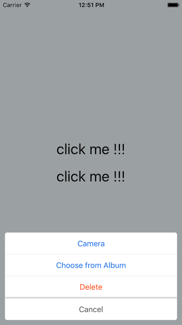

# ActionSheet for React Native
[](https://www.npmjs.com/package/react-native-zhb-actionsheet) [](https://www.npmjs.com/package/react-native-zhb-actionsheet)

ActionSheet component for React Native (iOS and Android)



## Installation

Get started with actionsheet by installing the node module:
```
$ npm install react-native-zhb-actionsheet --save
```

## Props

| prop | type | default | required | description |
| ---- | ---- | ---- | ---- | ---- |
| titles | array of object, [{title: string, actionStyle: oneOf(["default", "cancel", "destructive"]), action: func] | [] | yes | |
| onClose | func | none | no | |
| separateHeight | number | 4 | no | |
| separateColor | string(color) | '#dddddd' | no | |
| backgroundColor | string(color) | 'rgba(0, 0, 0, 0.4)' | no | |
| containerStyle | style | {} | no | |

## Methods
| method | type | description |
| ---- | ---- | ---- |
| show() | function | show the actionsheet |
| hide() | function | hide the actionsheet |

## Basic Usage

```
'use strict';

import React, {Component} from 'react';
import {
    View,
    Text,
    StyleSheet
} from 'react-native';

import ActionSheet from 'react-native-zhb-actionsheet';

export default class App extends Component {

    constructor(props) {
        super(props);
        this.defaultTitles = [{title: 'Camera', action: () => {console.log('click Camera');}},
            {title: 'Choose from Album', actionStyle: 'default', action: () => {console.log('click Choose from Album');}},
            {title: 'Delete', actionStyle: 'destructive', action: () => {console.log('click Delete');}},
            {title: 'Cancel', actionStyle: 'cancel', action: () => {console.log('click Cancel');}}
            ];
        this.customTitles = [{title: 'Title 1'}, {title: 'Title 2'}, {title: 'Title 3'}, {title: 'Title 4'}, {title: 'Title 5'},
            {title: 'Title 6'}, {title: 'Title 7'}, {title: 'Title 8'}];
        this.state = {
            titles: this.defaultTitles
        };
    }

    render() {
        return (
            <View style={styles.container}>
                <ActionSheet
                    ref="picker"
                    titles={this.state.titles}
                    separateHeight={3}
                    separateColor="#dddddd"
                    backgroundColor="rgba(0, 0, 0, 0.3)"
                    containerStyle={{margin: 10, borderRadius: 5}}
                    onClose={(obj) => {console.log('action sheet closed! clicked:' + JSON.stringify(obj));}}
                />

                <Text style={styles.welcome} onPress={() => {this.setState({titles: this.defaultTitles}, () => {this.refs.picker.show();})}}>
                    click me !!!
                </Text>
                <Text style={styles.welcome} onPress={() => {this.setState({titles: this.customTitles}, () => {this.refs.picker.show();})}}>
                    click me !!!
                </Text>
            </View>
        )
    }
}

const styles = StyleSheet.create({
    container: {
        flex: 1,
        justifyContent: 'center',
        alignItems: 'center',
        backgroundColor: '#F5FCFF',
    },
    welcome: {
        fontSize: 30,
        textAlign: 'center',
        margin: 10
    }
});
```

## Running the Example Project

You can check out the example project with the following instructions

1. Clone the repo: `git clone https://github.com/NoPPT/react-native-zhb-actionsheet.git`
2. Open: `cd react-native-zhb-actionsheet` and Install: `npm install`
3. Run `npm start` to start the packager.

## License
[MIT](./LICENSE)